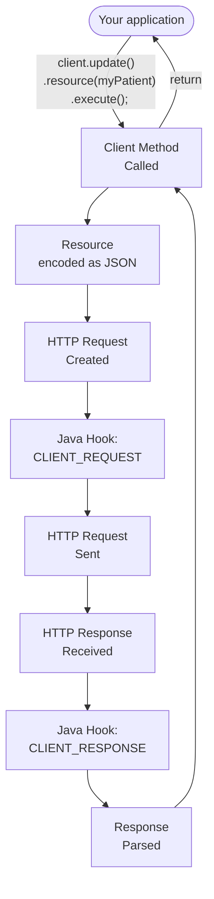

```mermaid
flowchart TB
    App(["Your application"]):::app
    MethodCalled["Client Method<br/>Called"]:::step
    Encode["Resource<br/>encoded as JSON"]:::step
    RequestCreated["HTTP Request<br/>Created"]:::step
    RequestSent["HTTP Request<br/>Sent"]:::step
    ResponseReceived["HTTP Response<br/>Received"]:::step
    Parsed["Response<br/>Parsed"]:::step

    RequestHook["Java Hook:<br/>CLIENT_REQUEST"]:::javahook
    ResponseHook["Java Hook:<br/>CLIENT_RESPONSE"]:::javahook

    App -- "client.update()<br/>&nbsp;&nbsp;.resource(myPatient)<br/>&nbsp;&nbsp;.execute();" --> MethodCalled
    MethodCalled --> Encode
    Encode --> RequestCreated
    RequestCreated --> RequestHook
    RequestHook --> RequestSent
    RequestSent --> ResponseReceived
    ResponseReceived --> ResponseHook
    ResponseHook --> Parsed
    Parsed --> MethodCalled
    MethodCalled -- "return" --> App

    click RequestHook "/apidocs/hapi-fhir-base/ca/uhn/fhir/interceptor/api/Pointcut.html#CLIENT_REQUEST" "Open CLIENT_REQUEST pointcut docs"
    click ResponseHook "/apidocs/hapi-fhir-base/ca/uhn/fhir/interceptor/api/Pointcut.html#CLIENT_RESPONSE" "Open CLIENT_RESPONSE pointcut docs"
```
