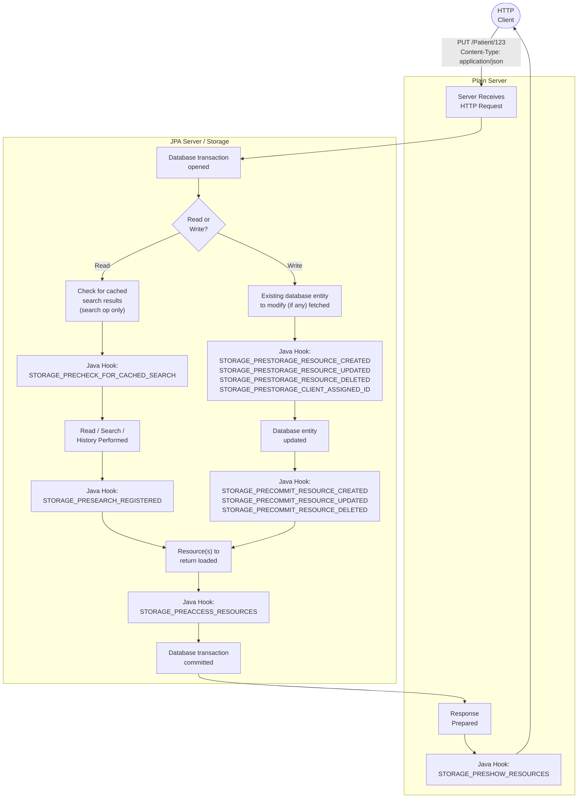

```mermaid
flowchart TB
    Client(["HTTP<br/>Client"]):::app

    subgraph PlainServer["Plain Server"]
        direction TB
        Receive["Server Receives<br/>HTTP Request"]:::step
        Response["Response<br/>Prepared"]:::step
        PreShowHook["Java Hook:<br/>STORAGE_PRESHOW_RESOURCES"]:::javahook
    end

    subgraph JPAStorage["JPA Server / Storage"]
        direction TB
        TxnOpen["Database transaction<br/>opened"]:::step
        Decide{"Read or<br/>Write?"}

        CacheCheck["Check for cached<br/>search results<br/>(search op only)"]:::step
        PreCheckHook["Java Hook:<br/>STORAGE_PRECHECK_FOR_CACHED_SEARCH"]:::javahook
        Search["Read / Search /<br/>History Performed"]:::step
        PreSearchHook["Java Hook:<br/>STORAGE_PRESEARCH_REGISTERED"]:::javahook

        FetchExisting["Existing database entity<br/>to modify (if any) fetched"]:::step
        PreStorageHook["Java Hook:<br/>STORAGE_PRESTORAGE_RESOURCE_CREATED<br/>STORAGE_PRESTORAGE_RESOURCE_UPDATED<br/>STORAGE_PRESTORAGE_RESOURCE_DELETED<br/>STORAGE_PRESTORAGE_CLIENT_ASSIGNED_ID"]:::javahook
        EntityUpdated["Database entity<br/>updated"]:::step
        PreCommitHook["Java Hook:<br/>STORAGE_PRECOMMIT_RESOURCE_CREATED<br/>STORAGE_PRECOMMIT_RESOURCE_UPDATED<br/>STORAGE_PRECOMMIT_RESOURCE_DELETED"]:::javahook

        Loaded["Resource(s) to<br/>return loaded"]:::step
        PreAccessHook["Java Hook:<br/>STORAGE_PREACCESS_RESOURCES"]:::javahook
        TxnCommit["Database transaction<br/>committed"]:::step
    end

    Client -- "PUT /Patient/123<br/>Content-Type: application/json" --> Receive
    Receive --> TxnOpen
    TxnOpen --> Decide

    Decide -- "Read" --> CacheCheck
    CacheCheck --> PreCheckHook
    PreCheckHook --> Search
    Search --> PreSearchHook
    PreSearchHook --> Loaded

    Decide -- "Write" --> FetchExisting
    FetchExisting --> PreStorageHook
    PreStorageHook --> EntityUpdated
    EntityUpdated --> PreCommitHook
    PreCommitHook --> Loaded

    Loaded --> PreAccessHook
    PreAccessHook --> TxnCommit
    TxnCommit --> Response
    Response --> PreShowHook
    PreShowHook --> Client

    click PreShowHook "/apidocs/hapi-fhir-base/ca/uhn/fhir/interceptor/api/Pointcut.html#STORAGE_PRESHOW_RESOURCES" "Open STORAGE_PRESHOW_RESOURCES pointcut docs"
    click PreCheckHook "/apidocs/hapi-fhir-base/ca/uhn/fhir/interceptor/api/Pointcut.html#STORAGE_PRECHECK_FOR_CACHED_SEARCH" "Open STORAGE_PRECHECK_FOR_CACHED_SEARCH pointcut docs"
    click PreSearchHook "/apidocs/hapi-fhir-base/ca/uhn/fhir/interceptor/api/Pointcut.html#STORAGE_PRESEARCH_REGISTERED" "Open STORAGE_PRESEARCH_REGISTERED pointcut docs"
    click PreStorageHook "/apidocs/hapi-fhir-base/ca/uhn/fhir/interceptor/api/Pointcut.html" "Open HAPI Pointcut docs (STORAGE_PRESTORAGE_RESOURCE_* family)"
    click PreCommitHook "/apidocs/hapi-fhir-base/ca/uhn/fhir/interceptor/api/Pointcut.html" "Open HAPI Pointcut docs (STORAGE_PRECOMMIT_RESOURCE_* family)"
    click PreAccessHook "/apidocs/hapi-fhir-base/ca/uhn/fhir/interceptor/api/Pointcut.html#STORAGE_PREACCESS_RESOURCES" "Open STORAGE_PREACCESS_RESOURCES pointcut docs"
```
