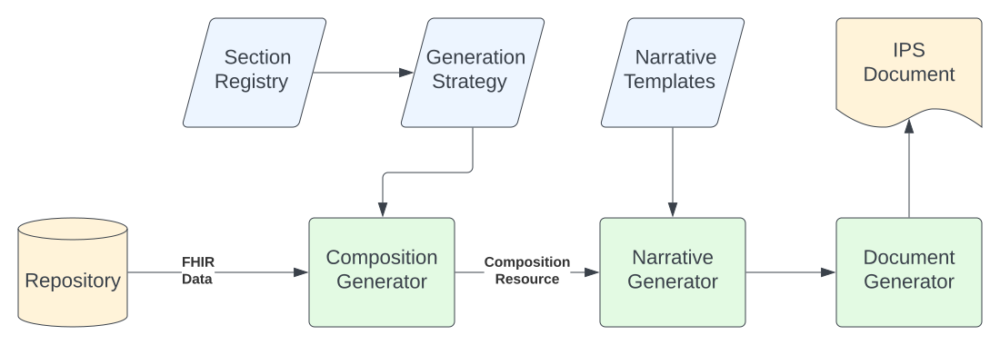

# International Patient Summary (IPS) Generator

The International Patient Summary (IPS) is an international collaborative effort to develop a specification for a health record summary extract. It is specified in the standards EN 17269 and ISO 27269, and supported in FHIR through the [International Patient Summary Implementation Guide](http://hl7.org/fhir/uv/ips/).

In FHIR, an IPS is expressed as a [FHIR Document](https://www.hl7.org/fhir/documents.html). The HAPI FHIR JPA server supports the automated generation of IPS documents through an extensible and customizable engine which implements the [`$summary`](http://hl7.org/fhir/uv/ips/OperationDefinition-summary.html) operation.

# Overview

<a href="ips/overview.svg" target="_blank"></a>

The IPS Generator uses FHIR resources stored in your repository as its input. The algorithm for determining which resources to include and how to construct the mandatory narrative is customizable and extensible, with a default algorithm included.

<a name="generation-strategy"/>

# Generation Strategy

A user supplied strategy class is used to determine various properties of the IPS. This class must implement the `IIpsGenerationStrategy` interface. A default implementation called `DefaultJpaIpsGenerationStrategy` is included. You may use this default implementation, use a subclassed version of it that adds additional logic, or use en entirely new implementation.

The generation strategy also supplies the [Narrative Templates](#narrative-templates) implementations, so it can be considered the central part of your IPS configuration.

* JavaDoc: [IIpsGenerationStrategy](/hapi-fhir/apidocs/hapi-fhir-jpaserver-ips/ca/uhn/fhir/jpa/ips/api/IIpsGenerationStrategy.html)
* Source Code: [IIpsGenerationStrategy.java](https://github.com/hapifhir/hapi-fhir/blob/master/hapi-fhir-jpaserver-ips/src/main/java/ca/uhn/fhir/jpa/ips/api/IIpsGenerationStrategy.java)

The default generation strategy defines the sections that will be included in your IPS. Out of the box, the standard IPS sections are all included. See the [IG homepage](http://hl7.org/fhir/uv/ips/) for a list of the standard sections.

* JavaDoc: [DefaultJpaIpsGenerationStrategy](/hapi-fhir/apidocs/hapi-fhir-jpaserver-ips/ca/uhn/fhir/jpa/ips/jpa/DefaultJpaIpsGenerationStrategy.html)
* Source Code: [DefaultJpaIpsGenerationStrategy.java](https://github.com/hapifhir/hapi-fhir/blob/master/hapi-fhir-jpaserver-ips/src/main/java/ca/uhn/fhir/jpa/ips/jpa/DefaultJpaIpsGenerationStrategy.java)


<a name="narrative-templates"/>

# Narrative Templates

The IPS Document includes a [Composition](http://hl7.org/fhir/composition.html) resource, and this composition must include a populated narrative for each section containing the relevant clinical details for the section.

The IPS generator uses HAPI FHIR [Narrative Generation](/hapi-fhir/docs/model/narrative_generation.html) to achieve this.

Narrative templates for individual sections will be supplied a Bundle resource containing only the matched resources for the individual section as entries (ie. the Composition itself will not be present and no other resources will be present). So, for example, when generating the _Allergies / Intolerances_ IPS section narrative, the input to the narrative generator will be a _Bundle_ resource containing only _AllergyIntolerance_ resources.

The narrative properties file should contain definitions using the profile URL of the individual section (as defined in the section definition within the generation strategy) as the `.profile` qualifier. For example:

```properties
ips-allergyintolerance.resourceType=Bundle
ips-allergyintolerance.profile=https://hl7.org/fhir/uv/ips/StructureDefinition-Composition-uv-ips-definitions.html#Composition.section:sectionAllergies
ips-allergyintolerance.narrative=classpath:ca/uhn/fhir/jpa/ips/narrative/allergyintolerance.html
```

Built-in Narrative Templates:
* Source Code: [ca.uhn.fhir.jpa.ips.narrative](https://github.com/hapifhir/hapi-fhir/blob/master/hapi-fhir-jpaserver-ips/src/main/resources/ca/uhn/fhir/jpa/ips/narrative/). Note the following:
    * Default properties file: [ips-narratives.properties](https://github.com/hapifhir/hapi-fhir/blob/master/hapi-fhir-jpaserver-ips/src/main/resources/ca/uhn/fhir/jpa/ips/narrative/ips-narratives.properties)
    * Example template for Allergies section: [allergyintolerance.html](https://github.com/hapifhir/hapi-fhir/blob/master/hapi-fhir-jpaserver-ips/src/main/resources/ca/uhn/fhir/jpa/ips/narrative/allergyintolerance.html) 
    * Fragments file containing common fragments used in multiple templates: [utility-fragments.html](https://github.com/hapifhir/hapi-fhir/blob/master/hapi-fhir-jpaserver-ips/src/main/resources/ca/uhn/fhir/jpa/ips/narrative/utility-fragments.html) 

# Credits

This module is based on the excellent work of Rio Bennin of Crossroads Labs, and Panayiotis Savva and Constantinos Yiasemi of the University of Cyprus.
