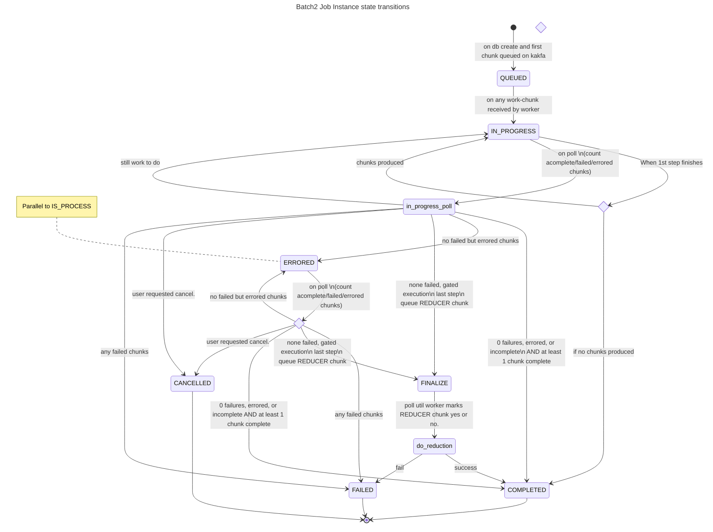
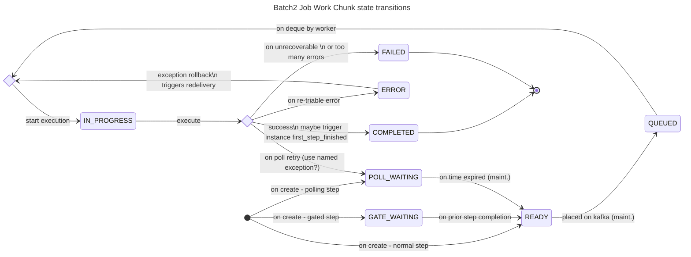

Work
### New state - READY
- create chunks in ready before they are queued
- new phase of job maint. : queue all READY chunks and move them to QUEUED in a safe way. (ca.uhn.fhir.batch2.maintenance.JobMaintenanceServiceImpl.doMaintenancePass)

### New step type POLLING
- Add a new field to WorkChunk: nextPollTimestamp (hapi + Mongo)
- A polling step function will throw a new named exception - RetryChunkLaterException.
- The chunk worker will catch RetryChunkLaterException, and move state from IN_PROGRESS->POLL_WAITING 
  and update nextPollTimestamp to now()+1 min
- Eat the ChunkRetryLaterException so the message is consumed from the queue.
  The chunk must not be re-queued by Spring.
- Add a new phase in the Batch Job Maintenance to update all chunks in POLL_WAITING->READY where nextPollTimestamp<=now()
  via query loop.
  (ca.uhn.fhir.batch2.maintenance.JobMaintenanceServiceImpl.doMaintenancePass) 

### New GATE_WAITING chunk state
- Add a new work chunk state GATE_WAITING
- Change our gated step advance - ca.uhn.fhir.batch2.maintenance.JobInstanceProcessor.triggerGatedExecutions 
  to transactionally update the gated chunks from GATE_WAITING->READY in the same tx we update the step of the job.
- Leave queueing to job maint. phase
