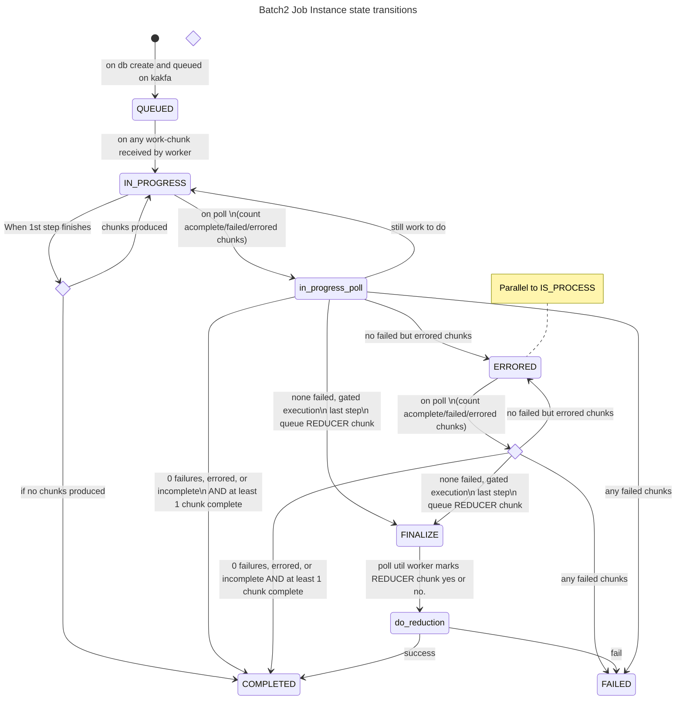
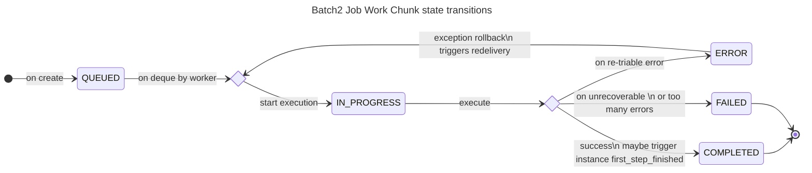

```mermaid
---
title: Batch2 Job Instance state transitions
---
stateDiagram-v2
  [*]         --> QUEUED         : on db create and queued on kakfa
  QUEUED      --> IN_PROGRESS    : on any work-chunk received by worker
  %%  and  (see ca.uhn.fhir.batch2.progress.InstanceProgress.getNewStatus())
  state first_step_finished <<choice>>
  IN_PROGRESS --> first_step_finished : When 1st step finishes
  first_step_finished --> COMPLETED: if no chunks produced
  first_step_finished --> IN_PROGRESS: chunks produced
  IN_PROGRESS --> in_progress_poll : on poll \n(count acomplete/failed/errored chunks)
  in_progress_poll --> COMPLETED   : 0 failures, errored, or incomplete\n AND at least 1 chunk complete
  in_progress_poll --> ERRORED   : no failed but errored chunks
  in_progress_poll --> FINALIZE   : none failed, gated execution\n last step\n queue REDUCER chunk
  in_progress_poll --> IN_PROGRESS : still work to do
  %% ERRORED is just like IN_PROGRESS, but it is a one-way trip from IN_PROGRESS to ERRORED.
  %% FIXME We could probably delete/merge this state with IS_PROCESS, and use the error count in the UI.
  note left of ERRORED
     Parallel to IS_PROCESS
  end note
  state in_progress_poll <<choice>>
  state error_progress_poll <<choice>>
  ERRORED --> error_progress_poll : on poll \n(count acomplete/failed/errored chunks)
  error_progress_poll --> FAILED   : any failed chunks
  error_progress_poll --> ERRORED   : no failed but errored chunks
  error_progress_poll --> FINALIZE   : none failed, gated execution\n last step\n queue REDUCER chunk
  error_progress_poll --> COMPLETED   : 0 failures, errored, or incomplete AND at least 1 chunk complete
  state do_report <<choice>>
  FINALIZE --> do_reduction: poll util worker marks REDUCER chunk yes or no.
  do_reduction --> COMPLETED : success
  do_reduction --> FAILED : fail
  in_progress_poll --> FAILED   : any failed chunks
```

```mermaid
---
title: Batch2 Job Work Chunk state transitions
---
stateDiagram-v2
    state QUEUED
    state on_receive <<choice>>
    state IN_PROGRESS
    state ERROR
    state execute <<choice>>
    state FAILED
    state COMPLETED
   direction LR
   [*]         --> QUEUED        : on create
  
  %% worker processing states
  QUEUED      --> on_receive : on deque by worker
  on_receive --> IN_PROGRESS : start execution
  
  IN_PROGRESS --> execute: execute
  execute --> ERROR       : on re-triable error
  execute --> COMPLETED   : success\n maybe trigger instance first_step_finished
  execute --> FAILED      : on unrecoverable \n or too many errors
  
  %% temporary error state until retry
  ERROR       --> on_receive : exception rollback\n triggers redelivery
  
  %% terminal states 
  COMPLETED       --> [*]
  FAILED       --> [*]
```
