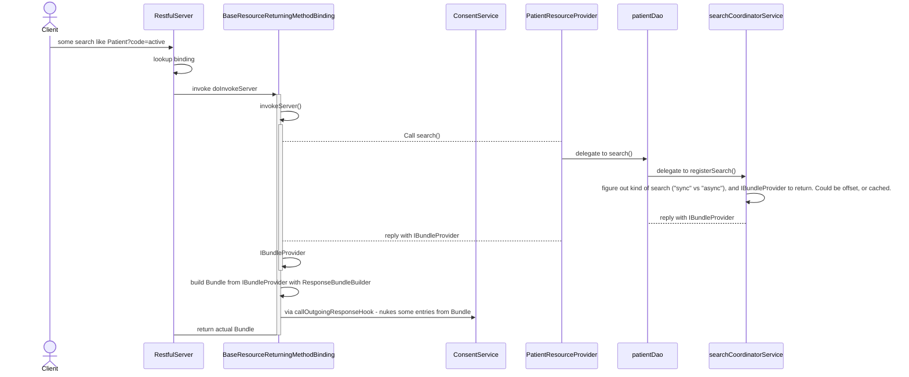

# Paging

Paging is complicated.

What we need to do to avoid "blank spots" from the ConsentService is to move the call into consent
before we finalize the Bundle.
ca.uhn.fhir.rest.server.method.ResponseBundleBuilder#pagingBuildResourceList looks likely.

